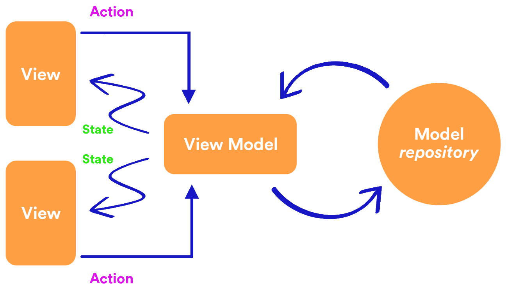
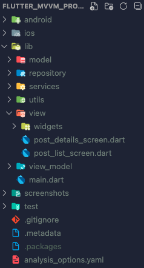

# MVVM Provider Practice

MVVM stands for **Model-View-ViewModel**. The basic idea is to create a view model that’ll provide data to the view. The view can use the data provided by the view model to populate itself. Creating a view-model layer allows us to write modular code, which can be used by several views.

<table align="center" style="margin: 0px auto;">
  <tr>
    <td></img></td>
  </tr>
</table>

## File Pattern Inside The `lib` Folder

</img>

```
    lib/
    ├── model/
    │   └── post.dart
    ├── repository/
    │   └── api_repository.dart
    ├── services/
    │   ├── api_service.dart
    │   ├── app_exception.dart
    │   └── base_service.dart
    ├── utils/
    │   ├── api_constants.dart
    │   └── size_config.dart
    ├── view/
    │   ├── widgets/
    │   │   └── post_item.dart
    │   ├── post_details_screen.dart
    │   └── post_list_screen.dart
    ├── view_model/
    │   ├── post_details_view_model.dart
    │   └── post_list_view_model.dart
    └── main.dart
```

## App Demo

<table align="center" style="margin: 0px auto;">
  <tr>
    <th>On an iPhone 8 Simulator</th>
  </tr>
  <tr>
    <td align="center"></img></td>
  </tr>
</table>
